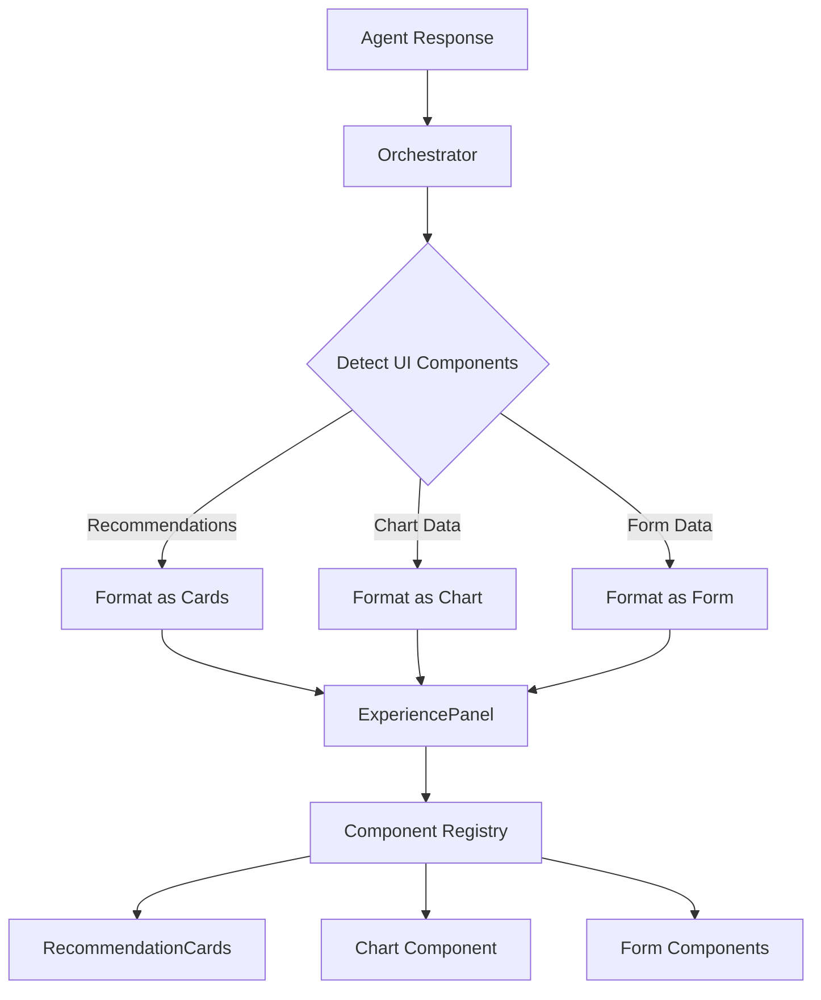

# Dynamic Experience Panel with Recommendation Cards

## Overview

Refactor the experience panel to be dynamically populated based on LLM responses. Add automatic detection and display of recommended campaigns and audience segments as individual cards. Make the UI generation system reusable across all agents.

## Architecture




## Implementation Plan

### 1. Backend: Add show_recommendations Tool

**File**: `backend/llm/tools.py`

- Add `show_recommendations` tool definition to `TOOLS` array
- Tool accepts:
- `items`: Array of recommendation objects (campaigns or segments)
- `type`: Type of recommendations ("campaign", "segment", or "mixed")
- `title`: Optional title for the recommendations section
- `description`: Optional description
- Add execution logic in `execute_tool()` that formats recommendations for frontend
- Tool returns structured data with `uiComponent: "recommendations"` metadata

### 2. Backend: Auto-Detection of Recommendations

**File**: `backend/orchestration/orchestrator.py`

- Add `_detect_recommendations()` method that:
- Scans agent response for recommendation patterns:
    - `analysis.audience_recommendations.existing_segments` → segment recommendations
    - `analysis.audience_recommendations.new_segment_suggestions` → segment recommendations
    - `evidence.historical_campaigns` → campaign recommendations (if marked as recommended)
    - `recommended_campaigns` → explicit campaign recommendations
    - `recommended_segments` → explicit segment recommendations
- Extracts and formats recommendations into card-ready structure
- Returns `{uiComponent: "recommendations", items: [...], type: "campaign|segment|mixed"}`
- Update `_format_response()` to:
- Call `_detect_recommendations()` after chart detection
- If recommendations found, add to `campaignConfig` with `uiComponent` metadata
- Set `experiencePanelType` to "recommendations" if recommendations exist and no chart

### 3. Backend: UI Component Metadata System

**File**: `backend/orchestration/orchestrator.py`

- Enhance `_format_response()` to support multiple UI components:
- Check for chart data → add `chart` component
- Check for recommendations → add `recommendations` component
- Check for form data → add `form` component
- Support multiple components in single response (e.g., chart + recommendations)
- Structure response as:
  ```python
      {
        "uiComponents": [
          {"type": "chart", "data": {...}},
          {"type": "recommendations", "data": {...}}
        ],
        "primaryComponent": "recommendations"  # or "chart", "form", etc.
      }
  ```


### 4. Frontend: Create Generic RecommendationCard Component

**File**: `frontend/src/components/RecommendationCard.svelte`

- Create reusable card component that accepts:
- `item`: Recommendation object (campaign or segment)
- `type`: "campaign" or "segment"
- `onClick`: Optional click handler
- Display:
- Title/name
- Description
- Key metrics (size, conversion rate, progress, etc.)
- Action buttons (View Details, Use This, etc.)
- Support both campaign and segment data structures
- Handle dark mode styling

### 5. Frontend: Create RecommendationCards Container Component

**File**: `frontend/src/components/RecommendationCards.svelte`

- Container component that:
- Accepts `items` array and `type` prop
- Renders grid/list of `RecommendationCard` components
- Handles empty states
- Supports filtering/sorting if needed
- Props:
- `items`: Array of recommendation objects
- `type`: "campaign", "segment", or "mixed"
- `title`: Optional section title
- `description`: Optional section description

### 6. Frontend: Refactor ExperiencePanel to Use Component Registry

**File**: `frontend/src/components/ExperiencePanel.svelte`

- Replace hardcoded conditionals with dynamic component mapping
- Create component registry:
  ```typescript
      const componentMap = {
        chart: Chart,
        recommendations: RecommendationCards,
        campaign_form: CampaignForm,
        campaign_list: CampaignList,
        segment_list: SegmentList,
        // ... etc
      }
  ```


- Update logic to:
- Check for `uiComponents` array in data
- Render primary component or first component
- Support rendering multiple components (e.g., chart above recommendations)
- Maintain backward compatibility with existing `experiencePanelType` system

### 7. Frontend: Update Stores (if needed)

**File**: `frontend/src/stores.ts`

- Ensure `experiencePanelData` can handle new structure with `uiComponents`
- No breaking changes to existing store structure

## Data Flow

1. **Agent Response**: Research/Campaign/Audience agent returns structured data
2. **Orchestrator Detection**: 

- `_detect_recommendations()` scans for recommendation patterns
- `_detect_chart_data()` scans for chartable data (existing)

3. **Response Formatting**: 

- Recommendations formatted with `uiComponent: "recommendations"`
- Chart data formatted with `uiComponent: "chart"`
- Primary component determined (recommendations > chart > form)

4. **Frontend Rendering**:

- ExperiencePanel checks for `uiComponents` or falls back to `experiencePanelType`
- Component registry maps component type to Svelte component
- RecommendationCards renders individual RecommendationCard components

## Recommendation Detection Patterns

The orchestrator will detect recommendations in:

- `analysis.audience_recommendations.existing_segments` → Segment IDs, fetch full segment data
- `analysis.audience_recommendations.new_segment_suggestions` → New segment suggestions
- `evidence.historical_campaigns` → If marked as recommended or if research context suggests recommendation
- `recommended_campaigns` → Explicit campaign recommendations
- `recommended_segments` → Explicit segment recommendations

## Files to Modify/Create

1. `backend/llm/tools.py` - Add show_recommendations tool
2. `backend/orchestration/orchestrator.py` - Add recommendation detection and UI component system
3. `frontend/src/components/RecommendationCard.svelte` - New generic card component
4. `frontend/src/components/RecommendationCards.svelte` - New container component
5. `frontend/src/components/ExperiencePanel.svelte` - Refactor to use component registry

## Backward Compatibility

- Maintain existing `experiencePanelType` system for compatibility