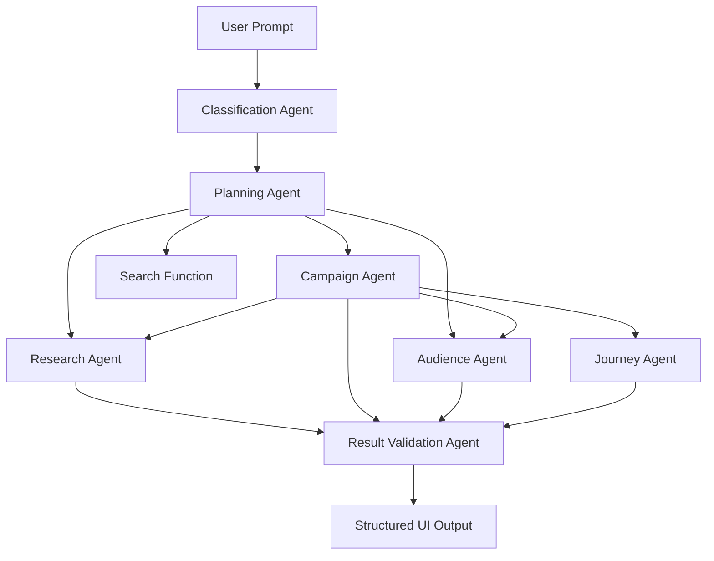
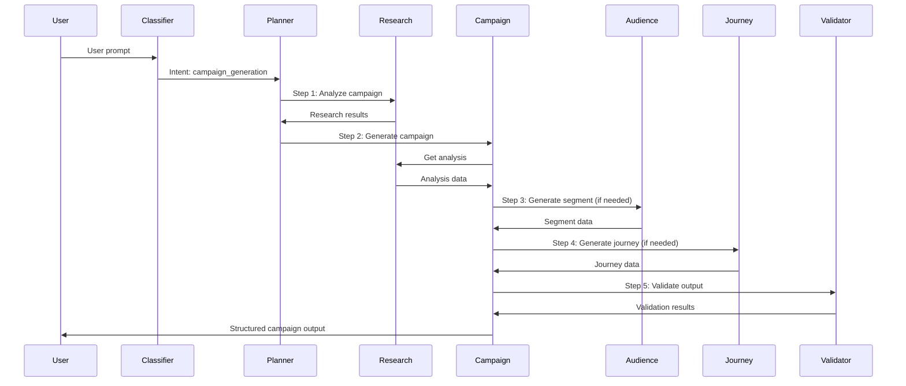
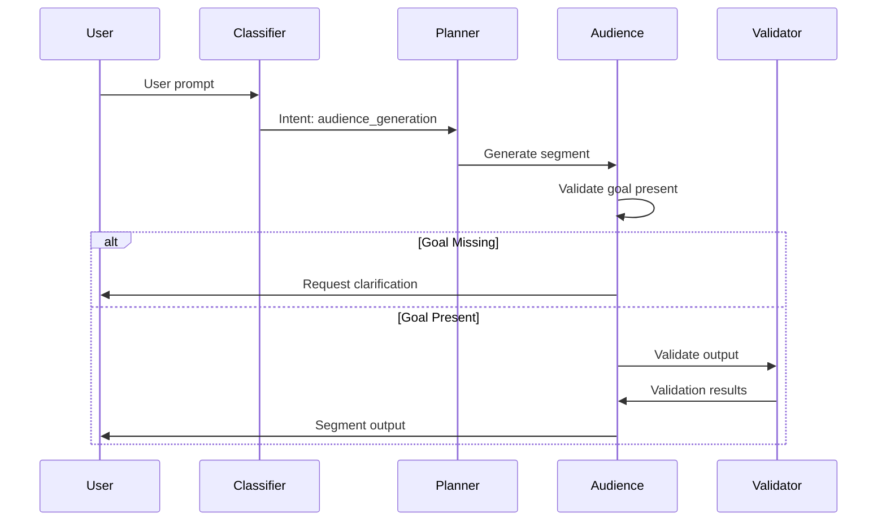

# LLM Agent System - Technical Requirements

## Overview

The Campaign Launchpad system uses a multi-agent LLM architecture to orchestrate campaign creation, audience segmentation, and marketing journey planning. The system employs Deepseek as the LLM provider, following OpenAI API specifications for compatibility and consistency.

## Architecture



## Agent Specifications

### 1. Classification Agent

**Purpose**: Classify user prompts into predefined intent categories to route requests appropriately.

**Input**:

- User prompt (string)
- Optional: Conversation context

**Output**:

```json
{
  "intent": "research" | "campaign_generation" | "audience_generation" | "search",
  "confidence": float (0.0-1.0),
  "reasoning": string
}
```

**Intent Categories**:

1. **research**: User is asking for analysis, recommendations, or insights
2. **campaign_generation**: User wants to create a new marketing campaign
3. **audience_generation**: User wants to create or modify audience segments
4. **search**: User is searching for existing campaigns, audiences, or knowledge articles

**Implementation**:

- LLM Model: Deepseek (via OpenAI-compatible API)
- System Prompt: Focus on intent classification with clear category definitions
- Temperature: 0.3 (for consistent classification)
- Max Tokens: 100

**Example System Prompt**:

```
You are a classification agent. Classify user prompts into one of these categories:
1. research - User seeks analysis, recommendations, or insights
2. campaign_generation - User wants to create a marketing campaign
3. audience_generation - User wants to create/modify audience segments
4. search - User is searching for existing items

Return JSON with intent, confidence (0-1), and brief reasoning.
```

---

### 2. Planning Agent

**Purpose**: Orchestrate multi-step workflows by routing user requests to appropriate specialist agents based on classification.

**Input**:

- User prompt (string)
- Classification result (from Classification Agent)
- Optional: Previous conversation context

**Output**:

```json
{
  "plan": [
    {
      "step": number,
      "agent": "research" | "campaign" | "audience" | "journey" | "search",
      "action": string,
      "input": object
    }
  ],
  "estimated_steps": number
}
```

**Routing Logic**:

1. **Research Intent**:

   - Route directly to Research Agent
   - Pass user prompt and context

2. **Campaign Generation Intent** (3-step process):

   - Step 1: Route to Research Agent for campaign analysis
   - Step 2: Route to Campaign Agent with research results
   - Step 3: Optional validation via Result Validation Agent

3. **Audience Generation Intent**:

   - Route directly to Audience Agent
   - Pass user prompt and campaign goal (if available)

4. **Search Intent**:
   - Call search function directly (not an agent)
   - Return search results to user

**Implementation**:

- LLM Model: Deepseek
- System Prompt: Focus on creating concise, multi-step, actionable plans
- Temperature: 0.5
- Max Tokens: 500

**Example System Prompt**:

```
You are a planning agent that orchestrates marketing campaign workflows.
Create concise, multi-step plans that route user requests to specialist agents.

For campaign generation:
1. First route to Research Agent for analysis
2. Then route to Campaign Agent with research results

For audience generation:
- Route directly to Audience Agent

For research:
- Route directly to Research Agent

Return a structured plan with steps, agent assignments, and inputs.
```

---

### 3. Research Agent

**Purpose**: Evaluate user prompts, historical campaign/audience data, and web search results to provide evidence-based recommendations for campaign planning, configuration, and optimization.

**Input**:

- User prompt (string)
- Optional: Campaign goal, constraints, or specific questions
- Historical data (accessed via tool calling)

**Output**:

```json
{
  "analysis": {
    "optimal_goal": string | array,
    "recommended_schedule": {
      "startDate": string,
      "endDate": string,
      "duration": number,
      "rationale": string
    },
    "recommended_channels": array,
    "channel_rationale": {
      "email": string,
      "sms": string,
      "push": string
    },
    "journey_variants": [
      {
        "variant_name": string,
        "flow_type": "sequential" | "parallel" | "conditional",
        "steps": array,
        "rationale": string
      }
    ],
    "audience_recommendations": {
      "existing_segments": array,
      "new_segment_suggestions": object
    }
  },
  "evidence": {
    "historical_campaigns": array,
    "historical_performance": object,
    "web_research": array
  },
  "rationale": string
}
```

**Tool Calling**:

- `get_campaigns(filters: object)`: Retrieve historical campaigns matching criteria
- `get_segments(filters: object)`: Retrieve audience segments
- `get_campaign_metrics(campaign_id: string)`: Get performance metrics for campaigns
- `web_search(query: string)`: Perform web search for best practices (optional)

**Implementation**:

- LLM Model: Deepseek
- System Prompt: Focus on evidence-based analysis with grounding
- Temperature: 0.7 (for creative analysis)
- Max Tokens: 2000
- Tool Calling: Enabled

**Example System Prompt**:

```
You are a Research Agent specializing in marketing campaign analysis.
Your role is to:
1. Analyze historical campaign and audience data
2. Provide evidence-based recommendations
3. Explain your rationale with specific data points
4. Suggest optimal campaign configurations

Always ground your recommendations in historical evidence.
Use tool calling to access campaign and audience databases.
Provide detailed rationale for each recommendation.
```

**Tool Specifications**:

```python
# Tool: get_campaigns
{
  "type": "function",
  "function": {
    "name": "get_campaigns",
    "description": "Retrieve historical campaigns with optional filters",
    "parameters": {
      "type": "object",
      "properties": {
        "goal": {"type": "string", "description": "Filter by campaign goal"},
        "status": {"type": "string", "description": "Filter by status (active, completed, draft)"},
        "limit": {"type": "integer", "description": "Maximum number of campaigns to return"}
      }
    }
  }
}

# Tool: get_segments
{
  "type": "function",
  "function": {
    "name": "get_segments",
    "description": "Retrieve audience segments with optional filters",
    "parameters": {
      "type": "object",
      "properties": {
        "name": {"type": "string", "description": "Filter by segment name"},
        "min_conversion_rate": {"type": "number", "description": "Minimum conversion rate"},
        "limit": {"type": "integer", "description": "Maximum number of segments to return"}
      }
    }
  }
}

# Tool: get_campaign_metrics
{
  "type": "function",
  "function": {
    "name": "get_campaign_metrics",
    "description": "Get performance metrics for a specific campaign",
    "parameters": {
      "type": "object",
      "properties": {
        "campaign_id": {"type": "string", "required": true, "description": "Campaign ID"}
      }
    }
  }
}
```

---

### 4. Audience Agent

**Purpose**: Generate audience segmentation based on user prompts and campaign goals.

**Input**:

- User prompt (string)
- Campaign goal (string, optional but recommended)
- Optional: Campaign context, constraints

**Output**:

```json
{
  "segment": {
    "name": string,
    "description": string,
    "filters": {
      "demographics": object,
      "behaviors": object,
      "custom_attributes": object
    },
    "estimated_size": number,
    "rationale": string
  },
  "recommendations": {
    "alternative_segments": array,
    "segmentation_strategy": string
  }
}
```

**Validation**:

- If campaign goal is missing or incomplete, return error requesting clarification
- Validate that segment filters are logically consistent
- Ensure estimated size is reasonable

**Implementation**:

- LLM Model: Deepseek
- System Prompt: Focus on creating actionable audience segments
- Temperature: 0.6
- Max Tokens: 1500

**Example System Prompt**:

```
You are an Audience Agent that creates marketing audience segments.

Requirements:
1. Analyze the campaign goal to determine target audience
2. Create segment filters based on demographics, behaviors, and attributes
3. Provide estimated segment size
4. Explain your segmentation rationale

If the campaign goal is missing or unclear, ask the user for clarification.
Return structured segment data ready for database storage.
```

**Error Handling**:

```json
{
  "error": true,
  "message": "Campaign goal is required to generate audience segment",
  "requested_info": ["campaign_goal", "target_demographics"]
}
```

---

### 5. Campaign Agent

**Purpose**: Generate structured campaign output that dynamically populates the user interface. Operates in multiple orchestrated steps.

**Input**:

- User prompt (string)
- Research results (from Research Agent, optional)
- Existing campaign data (if editing)

**Output**:

```json
{
  "campaign": {
    "name": string,
    "description": string,
    "goals": array,
    "startDate": string,
    "endDate": string,
    "segmentIds": array,
    "channels": array,
    "estimatedAudienceSize": number,
    "progress": number,
    "userFlowConfig": {
      "flowType": string,
      "steps": array,
      "variants": array
    },
    "variants": array,
    "creatives": array,
    "controlGroup": object
  },
  "missing_information": array,
  "recommendations": string
}
```

**Multi-Step Process**:

**Step 1: Research Analysis**

- Call Research Agent with user prompt
- Receive analysis and recommendations
- Extract key insights

**Step 2: Information Extraction**

- Analyze user prompt and research results
- Extract: campaign name, goals, timeline, channels, audience preferences
- Identify missing information

**Step 3: Audience Generation (Optional)**

- If no suitable existing audience segment found
- Call Audience Agent to generate new segment
- Incorporate segment into campaign configuration

**Step 4: Journey Generation (Optional)**

- If user journey recommendation is missing
- Call Journey Agent with: campaign goal, audience segment, duration
- Incorporate journey into campaign configuration

**Step 5: Campaign Construction**

- Assemble all components into structured output
- Validate completeness
- Format for UI population

**Implementation**:

- LLM Model: Deepseek
- System Prompt: Focus on structured output generation
- Temperature: 0.7
- Max Tokens: 3000
- Function Calling: Enabled (to call other agents)

**Example System Prompt**:

```
You are a Campaign Agent that generates structured campaign configurations.

Process:
1. Call Research Agent for analysis (if not provided)
2. Extract campaign information from prompt and research
3. Call Audience Agent if no suitable segment exists
4. Call Journey Agent if journey is missing
5. Construct complete campaign structure

Output must be structured JSON ready for UI population.
Identify any missing information that needs user input.
```

---

### 6. Journey Agent

**Purpose**: Create multi-stage user experience marketing funnels based on campaign goals, audience segments, and duration.

**Input**:

- Campaign goal (string or array)
- User segment (object)
- Campaign duration (number of days)
- Optional: Channel preferences, variant requirements

**Output**:

```json
{
  "journey": {
    "variants": [
      {
        "variant_name": string,
        "variant_id": string,
        "split_percentage": float,
        "steps": [
          {
            "step_id": string,
            "step_type": "logical_block" | "message_block",
            "order": number,
            "channel": "email" | "sms" | "push" | "paid_media",
            "message_config": {
              "subject": string,
              "content": string,
              "timing": string
            },
            "conditions": {
              "trigger": string,
              "next_step": string,
              "fallback": string
            }
          }
        ],
        "flow_type": "sequential" | "parallel" | "conditional"
      }
    ],
    "control_group": {
      "percentage": float,
      "description": string
    },
    "rationale": string
  }
}
```

**Requirements**:

- Support multiple journey variants for A/B testing
- Each variant can have multiple steps
- Steps can be logical blocks (conditions, delays) or message blocks
- Messages can use different channels (email, SMS, push, paid media)
- Must include control group configuration
- Steps should have clear ordering and conditional logic

**Implementation**:

- LLM Model: Deepseek
- System Prompt: Focus on creating effective marketing funnels
- Temperature: 0.7
- Max Tokens: 2500

**Example System Prompt**:

```
You are a Journey Agent that creates multi-stage marketing funnels.

Requirements:
1. Create multiple variants for A/B testing (typically 2-3 variants)
2. Design sequential, parallel, or conditional flows
3. Include logical blocks (delays, conditions) and message blocks
4. Support multiple channels (email, SMS, push, paid media)
5. Define control group (typically 10-20% of audience)
6. Provide clear rationale for journey design

Consider:
- Campaign goal when designing conversion points
- Audience segment characteristics for message personalization
- Campaign duration for timing optimization
- Channel effectiveness for goal achievement
```

---

### 7. Result Validation Agent

**Purpose**: Multi-purpose agent that evaluates outputs from other agents for logical consistency, coherence, and alignment with user requirements.

**Input**:

- Original user prompt (string)
- Agent output (object, from any agent)
- Agent type (string): "research" | "campaign" | "audience" | "journey"

**Output**:

```json
{
  "valid": boolean,
  "validation_results": {
    "logical_consistency": {
      "passed": boolean,
      "issues": array,
      "score": float
    },
    "coherence": {
      "passed": boolean,
      "issues": array,
      "score": float
    },
    "requirement_alignment": {
      "passed": boolean,
      "missing_requirements": array,
      "score": float
    },
    "data_quality": {
      "passed": boolean,
      "issues": array,
      "score": float
    }
  },
  "recommendations": array,
  "overall_score": float
}
```

**Validation Criteria**:

1. **Logical Consistency**:

   - Check for contradictory information
   - Verify data relationships (e.g., end date after start date)
   - Validate percentages sum correctly
   - Ensure segment filters are logically sound

2. **Coherence**:

   - Check for missing required fields
   - Verify output structure matches expected schema
   - Ensure all referenced IDs exist
   - Validate data types and formats

3. **Requirement Alignment**:

   - Compare output against original user prompt
   - Verify all requested features are present
   - Check for missing critical information
   - Ensure output addresses user intent

4. **Data Quality**:
   - Validate data ranges (e.g., percentages 0-100)
   - Check for reasonable values (e.g., audience size > 0)
   - Verify date formats and logical ordering
   - Ensure required fields are not null/empty

**Implementation**:

- LLM Model: Deepseek
- System Prompt: Focus on thorough validation and quality checking
- Temperature: 0.3 (for consistent validation)
- Max Tokens: 1500

**Example System Prompt**:

```
You are a Result Validation Agent that evaluates agent outputs for quality.

Validate:
1. Logical consistency - no contradictions, valid relationships
2. Coherence - complete structure, valid references
3. Requirement alignment - matches user intent
4. Data quality - valid ranges, formats, required fields

Return detailed validation results with specific issues and scores.
Provide actionable recommendations for improvement.
```

---

## Agent Orchestration Flow

### Standard Campaign Generation Flow



### Audience Generation Flow



## API Integration

### Deepseek API Configuration

**Base Configuration**:

```python
{
  "base_url": "https://api.deepseek.com/v1",
  "api_key": "DEEPSEEK_API_KEY",
  "model": "deepseek-chat",
  "api_version": "v1"
}
```

**OpenAI-Compatible Endpoints**:

- `POST /v1/chat/completions` - Main chat completion endpoint
- Uses same request/response format as OpenAI API

**Request Format**:

```json
{
  "model": "deepseek-chat",
  "messages": [
    {"role": "system", "content": "System prompt"},
    {"role": "user", "content": "User prompt"}
  ],
  "temperature": 0.7,
  "max_tokens": 2000,
  "tools": [...],
  "tool_choice": "auto"
}
```

**Response Format**:

```json
{
  "id": "chatcmpl-...",
  "object": "chat.completion",
  "created": 1234567890,
  "model": "deepseek-chat",
  "choices": [
    {
      "index": 0,
      "message": {
        "role": "assistant",
        "content": "...",
        "tool_calls": [...]
      },
      "finish_reason": "stop"
    }
  ],
  "usage": {
    "prompt_tokens": 100,
    "completion_tokens": 200,
    "total_tokens": 300
  }
}
```

## Tool Calling Implementation

### Tool Registration

All agents that require tool calling must register their tools:

```python
TOOLS = [
    {
        "type": "function",
        "function": {
            "name": "get_campaigns",
            "description": "Retrieve historical campaigns",
            "parameters": {...}
        }
    },
    {
        "type": "function",
        "function": {
            "name": "get_segments",
            "description": "Retrieve audience segments",
            "parameters": {...}
        }
    },
    # ... more tools
]
```

### Tool Execution

When an agent requests tool calls, execute them and return results:

```python
def execute_tool_call(tool_call):
    function_name = tool_call["function"]["name"]
    arguments = json.loads(tool_call["function"]["arguments"])

    if function_name == "get_campaigns":
        return get_campaigns_from_db(**arguments)
    elif function_name == "get_segments":
        return get_segments_from_db(**arguments)
    # ... handle other tools
```

## Error Handling

### Agent-Level Errors

Each agent should handle:

- **Invalid Input**: Return structured error with requested information
- **Tool Call Failures**: Retry with exponential backoff, fallback to alternative approach
- **LLM API Errors**: Retry up to 3 times, then return error to user
- **Timeout Errors**: Return partial results with indication of timeout

### Error Response Format

```json
{
  "error": true,
  "error_type": "validation_error" | "api_error" | "timeout" | "tool_error",
  "message": string,
  "requested_info": array,
  "retry_available": boolean
}
```

## Data Flow

### Input Processing

1. User prompt received
2. Classification Agent determines intent
3. Planning Agent creates execution plan
4. Plan executed step-by-step
5. Results validated
6. Structured output returned to UI

### Output Formatting

- All agent outputs must be valid JSON
- Follow predefined schemas for each agent type
- Include metadata: timestamp, agent_version, confidence_scores
- Ensure UI-ready structure

## Performance Requirements

- **Classification Agent**: < 1 second response time
- **Planning Agent**: < 2 seconds response time
- **Research Agent**: < 5 seconds (with tool calls)
- **Campaign Agent**: < 10 seconds (with orchestration)
- **Audience Agent**: < 3 seconds response time
- **Journey Agent**: < 4 seconds response time
- **Validation Agent**: < 2 seconds response time

## Security & Rate Limiting

- API keys stored securely (environment variables)
- Rate limiting: 100 requests per minute per user
- Token usage tracking and limits
- Input sanitization for all user prompts
- Output validation to prevent injection attacks

## Testing Requirements

- Unit tests for each agent's core logic
- Integration tests for agent orchestration flows
- End-to-end tests for complete user journeys
- Validation tests for output schemas
- Performance tests for response times
- Error handling tests for failure scenarios

## Implementation Notes

1. **Agent State Management**: Each agent should be stateless; state maintained in dialog sessions
2. **Caching**: Cache research results and validation results for identical inputs
3. **Logging**: Log all agent interactions, tool calls, and outputs for debugging
4. **Monitoring**: Track agent performance, error rates, and token usage
5. **Versioning**: Support agent versioning for gradual updates
