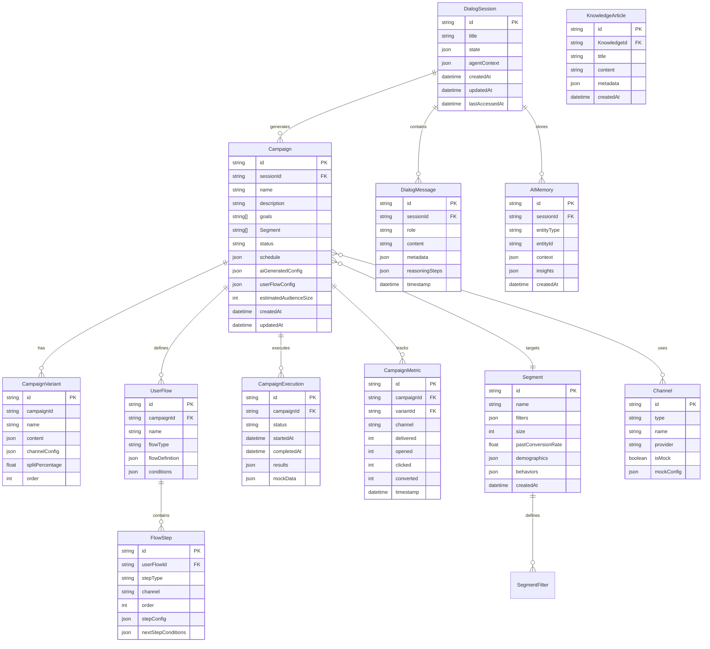

# AI-native Campaign Orchestrator - Product Requirements Document

## 1. Executive Summary

### Project Overview

"Campaign Launchpad" is a proof-of-concept designed to orchestrate and manage multi-channel marketing campaigns through an AI focused interface. The system enables campaign managers to plan, configure, execute, and analyze campaigns across various channels from a unified interface, through text prompts.

### Objectives

- Demonstrate the feasibility of a centralized, AI-native campaign orchestration system
- Provide a working prototype that showcases core orchestration capabilities
- Validate technical architecture and integration patterns
- Enable rapid campaign creation and deployment
- Mock data is acceptable to showcase the proof-of-technology

### Key Stakeholders

- **Campaign Managers**: Primary users who create and manage campaigns

### Success Criteria for POC

- Successfully demostrate interactive UX for 2 different campaign types
- Showcase 2+ channels (e.g., email, SMS, push)
- Demonstrate agent orchestration

---

## 2. Problem Statement

### Current Challenges

- Marketers plan and execute campaigns across fragmented tools (Engage, Personalization, Creative, Paid Media, Service), resulting in duplicated effort, conflicting messages, wasted spend, and limited strategic visibility. Existing CDPs optimize execution per channel, but fail to support strategic orchestration across suites.

### Objective

- **AI-native Interface**: Enable marketers to plan, reason about, and orchestrate campaigns across channels through an prompt based interactive experience. Interface is dynamically built, based on user prompt.
- **Automated Orchestration**: Automated scheduling and execution reduces manual errors

---

## 3. Solution Overview

### High-Level System Architecture

```mermaid
graph TB
    subgraph "User Interface Layer"
        UI[Campaign Orchestration UI]
        Knowledge [User Generated Prompts]
    end

    subgraph "Application Layer"
        API[Campaign API]
        AgentOrchestrator[Campaign Orchestrator Engine]
\       Analytics[Analytics Service]
    end

    subgraph "Data Layer"
        DialogSessionDB[(Historical Dialog Session Database)]
        CampaignDB[(Campaign Database)]
        AudienceDB[(Audience segment Database)]
        KnowledgeDB[(Knowledge Database)]
        MemoryDB[(AI Memory Database)]
    end

    subgraph "Integration Layer"
        EmailAdapter[Mock Email Service Adapter]
        SMSAdapter[Mock SMS Service Adapter]
        PushAdapter[Mock Push Notification Adapter]
    end

    subgraph "External Services"
        EmailService[Email Provider]
        SMSService[SMS Provider]
        PushService[Push Provider]
    end

    UI --> API
    Knowledge --> API
    API --> Orchestrator
    API --> Analytics
    API --> DialogSessionDB
    Orchestrator --> EmailAdapter
    Orchestrator --> SMSAdapter
    Orchestrator --> PushAdapter
    Orchestrator --> CampaignDB
    Orchestrator --> AudienceDB
    Orchestrator --> KnowledgeDB
    Orchestrator --> MemoryDB
    EmailAdapter --> EmailService
    SMSAdapter --> SMSService
    PushAdapter --> PushService
```

### Key UI Components

- **Action Bar**: This layout component is persistently anchored at the top of the interface for consistent access. It holds other components such as the User Input and Dialog History.
- **User Input**: Handles user prompt submission to initiate search or AI workflow. Supports adding Knowledge articles, enabling external connectors, and attaching documents as contextual inputs. The input initiate search for audience and campaign on short length keywords, and support AI prompting for long length keywords. This component sits within the Action Bar layout container.
- **Dialog History**: Selecting the Dialog History button opens a modal displaying a list of historical dialog sessions. Selecting a session loads its associated state and updates the Agent Canvas accordingly. Users can also initiate a new dialog session by selecting New Request, which resets the Agent Canvas to its default state. This option sits within the Action Bar layout container.
- **Agent Canvas**: A responsive, two-column layout that occupies all available space beneath the Action Bar. Left Column (Dialog Panel): Displays the active conversation, prompts, and agent interactions.

Right Column (Experience Panel): Displays contextual outputs, workflows, or supporting experiences related to the active dialog.

Empty State: When no dialog is active, the Agent Canvas renders as a single-column layout. This state presents entry-point options to access the Campaign List, Audience List, and Knowledge, guiding users toward initiating an interaction.

- **Dialog Panel**: Display active conversion, prompts, and agent interactions. Show reasoning steps in expandable module. The dialog panel can be optional minimized to save screen real estate.
- **Experience Panel**: Displays outputs generated by the orchestration agent in response to the current conversation context. Each specialized agent (for example, CampaignGeneratorAgent) produces a distinct, structured output format, which is rendered according to its defined schema and interaction model. The experience panel can be optionally minimized to save screen real estate.

### Core Value Proposition

- **AI-native Campaign Management**: Manage all campaign types from a single platform through AI. Dynamically populate UI
- **Intelligent Orchestration**: Automated agent routing and tool calling with built-in error handling

---

### Key Differentiators

- **Channel-Agnostic Design**: Abstract campaign logic from specific channel implementations
- **Agent-Driven Architecture**: Responsive User Experience Based On Agent Orchestration
- **AI-Generated Campaign**: Research and execute campaign based on suggestions from specialist agents

---

### Key Use Cases

#### UC1: Create Multi-Channel Campaign Through AI

**Actor**: Campaign Manager  
**Description**: Use AI prompt to generate campaign
**Flow**:

1. User enters campaign request as a prompt the user input box. Any attached context is also shared as input.
2. Agent Orchestrator classifies user intent
3. Agent Orchestrator routes "Campaign Request" intent to the CampaignGenerationAgent
4. CampaignGenerationAgent uses API to access CampaignDB, AudienceDB for relevant historical campaign results
5. CampaignGenerationAgent perform deep analysis on campaign and audience data for the most optimal campaign configuration (timing, duration, user journey graph, campaign variants, channel, control)
6. Dialog Panel shows agent reasoning steps, and output the deep research proposal (proposal explains clearly why this configuration is optimal based on historical evidence and web knowledge).
7. Experiece panel shows an interactable user interface with suggested campaign name, description, timing, duration, user journey graph, campaign variants, channel, control. Each field is interactable to be edited. Not all fields have to be filled.
8. User can continue iterating through dialog with agent to improve the campaign configuration until satisfied. Agent should take experience panel's existing input as consideration in planning next steps
9. User reviews and schedules the campaign.

**Postconditions**: Campaign created and scheduled for execution

#### UC2: Seach for a campaign, audience segment, or Knowledge article

**Actor**: Campaign Manager  
**Description**: Search campaign and audience using just text input
**Flow**:

1. User enters short text (less than) in the user input box.
2. Search dropdown shows fuzzy match for the name across categories of campaign, audience segment, and Knowledge article
3. User selects a choice from dropdown
4. Experience panel is updated to show the detail of the selected campaign, audience segment or Knowledge article.

**Postconditions**: Experience panel is updated with UX. Dialog panel shows search term.

#### UC3: Access campaign, audience, or Knowledge article table from agent canvas empty state

**Actor**: Campaign manager
**Description**: Access full page campaign, audience, and knowledge table interface
**Flow**:

1. User opens the web app
2. User selects campaign, audience, or Knowledge from the empty state option
3. Experience panel is updated to show campaign, audience segment or Knowledge table.
4. User can explore a specific campaign in more detail, or return to the list

**Postconditions**: User can access campaign, audience, and Knowledge data through table UI in the experience panel

## 4. Functional Requirements

### 4.1 Multi-Channel Campaign Generation Through AI

**FR-1.1**: Campaign Generation

- System shall allow users to generate campaigns with the following attributes:
  - Campaign name (required, max 100 characters)
  - Campaign description (optional, max 500 characters)
  - Campaign goal (Start session, purchase, custom event, open message)
  - Target audience/segment
  - Estimated audience size
  - Schedule (immediate or scheduled)
  - User Flow (connectivity between steps and variants with interactivity )
  - Campaign channel (Email, SMS, Push, Multi-Channel)
  - Message creative content (channel-specific)
  - Status (Draft, Scheduled, Active, Paused, Completed)

**FR-1.2**: Campaign Editing

- Users shall be able to edit draft campaigns
- Users shall be able to pause active campaigns
- Users shall be able to cancel scheduled campaigns before execution
- System shall maintain campaign version history

**FR-1.3**: Campaign Deletion

- Users shall be able to delete draft campaigns
- Active campaigns cannot be deleted (must be paused first)
- Deleted campaigns shall be archived for 30 days

### 5.2 Multi-Channel Campaign Support

**FR-2.1**: Channel Selection

- System shall support Email, SMS, and Push Notification channels
- Users shall be able to select one or multiple channels per campaign
- System shall use mock data

**FR-2.2**: User Flow Rules

- System shall support sequential flow execution (Channel A then Channel B)
- System shall support parallel flow execution (all channels simultaneously)
- System shall support conditional flow execution (Channel B only if Channel A succeeds)
- Users shall be able to define custom orchestration workflows

### 5.3 Audience Segmentation

**FR-3.1**: Segment Definition

- System shall allow users to define audience segments
- Segments shall support filtering by:
  - Segment name
  - Demographics (age, gender, location)
  - Behavior (purchase history, engagement history)
  - Custom attributes
  - Segment size (number of individuals)
  - Past conversion rate per associated campaign
- System shall support segment size preview
- System shall use mock data for audience segments

**FR-3.2**: Segment Management

- Users shall be able to create, edit, and delete segments

### 5.3 A/B Testing Capabilities

**FR-3.1**: Variant Creation through User Flow

- Users shall be able to create campaign variants (A, B, C, etc.)
- Each variant shall have independent message content
- Users shall be able to set split percentages (must sum to 100%)

**FR-3.2**: Variant Assignment

- System shall randomly assign audience members to variants
- Assignment shall be consistent (same user always gets same variant for same campaign)

**FR-3.3**: Performance Comparison

- System shall track metrics separately for each variant
- System shall display performance comparison once campaign is complete
- System shall identify winning variant based on conversion rate
- System shall provide statistical significance indicators
- For completed campaigns, System shall use mock data to populate its performance

### 5.4 Integration Capabilities

**FR-7.1**: Channel Integrations

- System shall use mock data for email, SMS, and push notification integrations
- System shall support multiple providers per channel type

**FR-7.2**: API Access

- System shall provide RESTful API for campaign management
- API shall support CRUD operations for campaigns
- API shall support CRUD operations for audiences
- API shall support CRUD operations for Knowledge
- API shall support CRUD operations for dialog session

---

## 6. Non-Functional Requirements

### 6.1 Reliability and Availability

**NFR-1.1**: Error Handling

- System shall implement retry logic for failed operations
- System shall provide clear error messages to users
- System shall notify administrators of critical failures
- Failed campaign executions shall be logged and recoverable

**NFR-1.2**: Data Consistency

- Campaign state shall be consistent across all system components
- Database transactions shall ensure data integrity
- System shall handle concurrent campaign modifications gracefully
- System shall use mock data

### 6.2 Usability Requirements

**NFR-2.1**: User Interface

- UI shall be responsive and work on desktop and tablet devices
- UI shall support dark mode
- Navigation shall be intuitive with maximum 3 clicks to any feature

**NFR-5.2**: Documentation

- System shall provide in-app help and tooltips
- API documentation shall be comprehensive and up-to-date
- User guides shall be available for common workflows

---

## 7. Technical Architecture

### 7.1 System Components

```mermaid
graph LR
    subgraph "Frontend"
        React[React Application]
        Components[UI Components]
        State[State Management]
    end

    subgraph "Backend API"
        Backend[Backend Server]
        Controllers[API Controllers]
        Middleware[Auth Middleware]
    end

    subgraph "Orchestration Engine"
        Engine[Orchestrator Core in Python]
    end

    subgraph "Services"
        AnalyticsService[Analytics Service in Python]
    end

    subgraph "Adapters"
        EmailAdapter[Email Adapter]
        SMSAdapter[SMS Adapter]
        PushAdapter[Push Adapter]
    end

    subgraph "Data Layer"
        JSON Mockdata[(JSON file)]
    end
```

### 7.2 Technology Stack Recommendations

**Frontend**:

- pick the best option

**Backend**:

- Pick the best option

### 7.3 Data Model

**Core Entities**:



### 7.4 API Design Considerations

**RESTful API Structure**:

- Base URL: `/api/v1`
- Response format: JSON
- Error responses: Standardized error format with status codes
- Authentication: Not required for POC (mock data environment)

**Agent Orchestration Endpoints**:

- `POST /api/v1/agent/orchestrate` - Process user prompt and route to appropriate agent
- `POST /api/v1/agent/campaign/generate` - Generate campaign configuration via AI agent
- `POST /api/v1/agent/campaign/analyze` - Analyze campaign and provide recommendations
- `GET /api/v1/agent/status/:taskId` - Get status of async agent task

**Dialog Session Endpoints**:

- `GET /api/v1/dialog/sessions` - List all dialog sessions
- `POST /api/v1/dialog/sessions` - Create new dialog session
- `GET /api/v1/dialog/sessions/:id` - Get dialog session details with messages
- `PUT /api/v1/dialog/sessions/:id` - Update dialog session state
- `DELETE /api/v1/dialog/sessions/:id` - Delete dialog session
- `POST /api/v1/dialog/sessions/:id/messages` - Add message to dialog session
- `GET /api/v1/dialog/sessions/:id/messages` - Get all messages in session

**Campaign Endpoints**:

- `GET /api/v1/campaigns` - List campaigns
- `POST /api/v1/campaigns` - Create campaign (AI-generated or manual)
- `GET /api/v1/campaigns/:id` - Get campaign details
- `PUT /api/v1/campaigns/:id` - Update campaign
- `DELETE /api/v1/campaigns/:id` - Delete campaign
- `POST /api/v1/campaigns/:id/execute` - Execute campaign
- `GET /api/v1/campaigns/:id/metrics` - Get campaign metrics (mock data)
- `GET /api/v1/campaigns/:id/userflow` - Get campaign user flow configuration

**Search Endpoints**:

- `GET /api/v1/search` - Unified search across campaigns, segments, and Knowledge
  - Query params: `q` (search term), `type` (campaign|segment|Knowledge|all)
  - Returns fuzzy-matched results with category and relevance score

**Segment Endpoints**:

- `GET /api/v1/segments` - List segments
- `POST /api/v1/segments` - Create segment
- `GET /api/v1/segments/:id` - Get segment details
- `PUT /api/v1/segments/:id` - Update segment
- `DELETE /api/v1/segments/:id` - Delete segment
- `GET /api/v1/segments/:id/preview` - Preview segment size and composition

**Knowledge Endpoints**:

- `GET /api/v1/Knowledge` - List Knowledge articles
- `POST /api/v1/Knowledge` - Create Knowledge article
- `GET /api/v1/Knowledge/:id` - Get Knowledge article details
- `PUT /api/v1/Knowledge/:id` - Update Knowledge article
- `DELETE /api/v1/Knowledge/:id` - Delete Knowledge article
- `POST /api/v1/Knowledge/:id/attach` - Attach Knowledge article to dialog session context

**AI Memory Endpoints**:

- `GET /api/v1/memory/:sessionId` - Get AI memory for session
- `POST /api/v1/memory/:sessionId` - Store AI memory entry
- `GET /api/v1/memory/:sessionId/context` - Get contextual memory for agent use

**API Versioning**:

- Version in URL path (`/api/v1/`)
- Backward compatibility maintained for at least 2 versions

---

## 8. Mock Data Requirement

**Audience Generation Requirement**

- Generate at least 10 audience segments. Within this, at least 5 are variations of outdoor audience, such as such as hikers, campers, trail runners, climbers, and outdoor adventure travelers.

**Campaign Generation Requirement**

- Generate at least 10 campaigns. Campaign can have titles such as, but not limited to: New Shoe Introduction, Christmas Sales
- Supported categories include, but are not limited to: Acquisition, Activation, Engagement, Retention, Reactivation, Upsell/Cross-sell, Brand Awareness, and Promotional/Seasonal campaigns

**Knowledge Generation Requirement**

- Generate at least 5 Knowledge articles
- Each Knowledge article should contain frequently repeated context about the business. It can describes, but not limited to, topics such as company-wide marketing goal, seasonal sales strategy, and campaign mistakes to avoid
